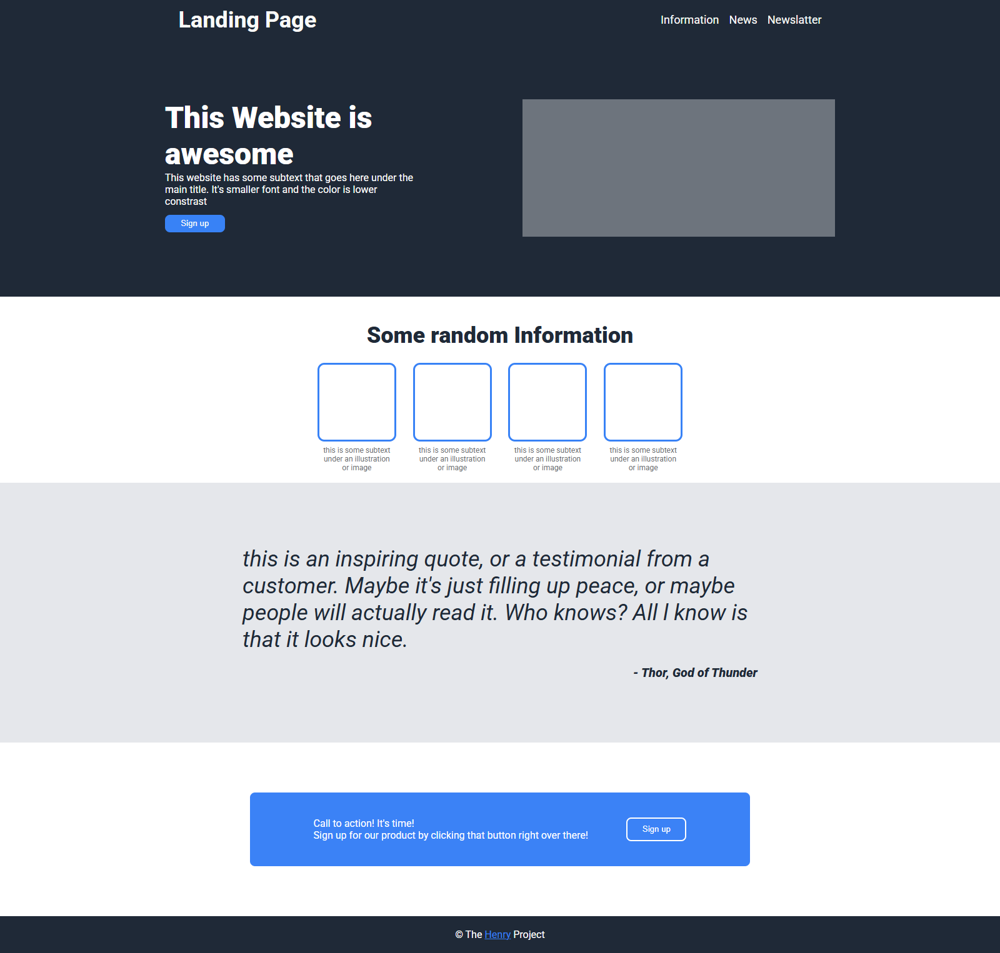

# Project Landing Page Odin

I'm always looking to improve my skills, so any feedback on the project, code, architecture, or best practices is very welcome! If you’d like to contribute with suggestions, you can:

📧 Send me an email: henrykaua21@gmail.com 

🔗 Connect with me on [LinkedIn](https://www.linkedin.com/in/henry-kaua/)

🐛 Open an [issue](https://github.com/henrymzs/api-todolist/issues) in the repository 

Any help is greatly appreciated and contributes to my growth as a developer. 🚀

This was a challenge project from The Odin Project curriculum, where the goal was to create a landing page. They provided a screenshot to replicate, along with the colors and fonts. From there, we had to figure out the best way to structure the page in HTML and then style it with CSS.

For the layout, I relied heavily on Flexbox because, unlike Grid, I use it more often and feel more comfortable working with it. After a few hours of work, I was able to achieve the result below.

